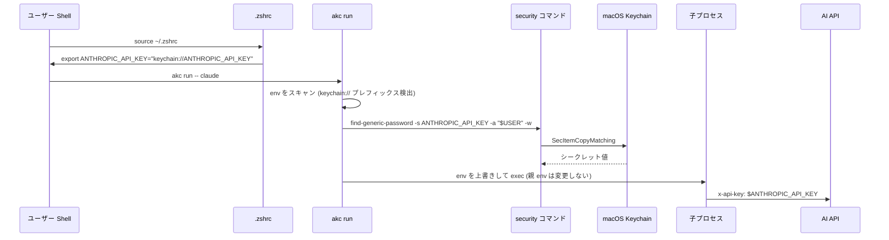

## はじめに

AI 開発をしていると、手元の `.env` や `.zshrc` が **API キーの墓場** になりがちです。Anthropic、OpenAI、xAI、GitHub、Cloudflare、Tailscale ──。プロジェクトを増やすたびに `export ANTHROPIC_API_KEY=sk-ant-...` が積み上がり、`env` コマンドを叩けば全部丸見え。

そんな中、私は macOS ネイティブのオープンソース API キー管理アプリ **AI KeyChain** を開発しています。先日リリースした **v1.6.0** で、1Password の `op://` ワークフローに相当する **Secret Reference モード** を追加したので、その設計と使い方を紹介します。

- リポジトリ: https://github.com/aieo-product/AIkeychain
- リリース: https://github.com/aieo-product/AIkeychain/releases/tag/v1.6.0
- 設計書: https://aieo-product.github.io/AIkeychain/design/

## 🔑 なぜ `.env` ではダメなのか

「みんな `.env` 使ってるじゃん」と思うかもしれません。実際それで動きますし、開発体験もシンプルです。

ただ、AI 開発の文脈では問題が大きくなってきています。

### 環境変数経由の漏洩は「普通に起きる」

GitGuardian の 2026 年レポートによると、**公開 GitHub に流出したシークレットは 2900 万件**。さらに **AI 支援コードの流出率はベースラインの約 2 倍** と報告されています。

直近の事件で言えば、**LiteLLM**（月 9700 万 DL の OSS LLM プロキシ）の v1.82.7 / 1.82.8 に資格情報窃取マルウェアが混入していたケースがあります。SSH キー、クラウドの資格情報、DB パスワード、**LLM API キー** を開発者のマシンから収集していました。被害ベクトルは「環境変数や設定ファイルから読む」が中心です。

要するに、**シェル環境変数に API キー値が居続けている時点で攻撃面**になります。

### 露出する経路は意外と多い

- `env` / `printenv` コマンド
- `ps eww` (環境変数を含むプロセス情報)
- コアダンプ・スワップ
- 子プロセスへの自動継承（あるツールが裏で送信）
- シェルの履歴・スクリプトのログ

「ローカルだけだから」と油断できる環境ではなくなりつつあります。

## 🛠 既存の解決策とトレードオフ

代表的な選択肢を 4 つ並べます。

| 方式 | env への露出 | 必要なもの | コスト |
|------|:----:|----------|------|
| `.env` 平文 | あり | なし | 無料 |
| `.zshrc` で `security` 直接参照 | あり (export 後) | macOS Keychain | 無料 |
| 1Password CLI (`op://` + `op run`) | なし (注入時のみ) | 1Password 有料アカウント | 月額 |
| Doppler / Infisical | なし (注入時のみ) | クラウド SaaS / 自前運用 | サービス費 / 運用 |

`.zshrc` で `security find-generic-password` を呼ぶ手法は OSS 文化圏で人気です ([参考: dev.to](https://dev.to/alsaheem/how-to-store-secrets-in-the-mac-keychain-and-use-them-like-environment-variables-1aj7), [Dustin Rue](https://dustinrue.com/2025/02/secure-storage-of-shell-secrets-such-as-api-keys/))。値はディスクに平文で残らないので一歩進んだ防御になります。

ただし注意点があり、**`export` した瞬間にシェル env にキー値が乗る** ため、そこから子プロセス・ログ・ダンプへ広がる経路は変わりません。

そこで効くのが 1Password の **`op://` 参照 + `op run`** モデルです。`.env` には `ANTHROPIC_API_KEY=op://Vault/anthropic/credential` のような **参照** だけを置き、`op run -- python main.py` のように起動すれば、**子プロセス env にだけ実値が注入** されます。親シェル env には参照しか残りません。

筋がいい設計ですが、有料プランに依存します。「macOS Keychain でこれをやれないか？」というのが今回のテーマです。

## 🆕 AI KeyChain の Secret Reference モード

v1.6.0 で導入した Secret Reference モードは、まさにそれを実現します。

### 仕組み



ポイントは 3 点です。

1. `.zshrc` には参照文字列 `keychain://KEY_NAME` だけが入る
2. `akc run -- <command>` を実行すると、CLI が env をスキャンして該当キーを `security find-generic-password` で解決
3. 解決した値は **`exec` する子プロセスの env にしか入らない** （親シェル env は変更しない）

### `akc` CLI の中身

実装は **Bash スクリプト 1 本** です（`scripts/akc`、依存ゼロ）。コアは次のような処理です。

```bash
# keychain:// 参照を解決
resolve_keychain() {
    local key_name="$1"
    security find-generic-password -s "$key_name" -a "$USER" -w 2>/dev/null
}

# env をスキャン → 該当変数の値を上書き → exec
while IFS='=' read -r name value; do
    if [[ "$value" == keychain://* ]]; then
        key_name="${value#keychain://}"
        resolved=$(resolve_keychain "$key_name")
        env_overrides+=("$name=$resolved")
    fi
done < <(env)

exec env "${env_overrides[@]}" "$@"
```

特殊な依存はなく、Touch ID / パスワードゲートも macOS が標準で挟んでくれます。

`akc run --dry-run` を付けると、解決対象のキー名と文字数だけが表示され、**値そのものは出力されません** （ログに値が残らないように）。

### 親 env と子 env の違い

```bash
# 親シェルでの env (Secret Reference モード)
$ env | grep ANTHROPIC
ANTHROPIC_API_KEY=keychain://ANTHROPIC_API_KEY   # ← 参照だけ

# 子プロセス内での env (akc run 経由)
$ akc run -- env | grep ANTHROPIC
ANTHROPIC_API_KEY=sk-ant-api03-***               # ← ここでだけ実値
```

親シェル env に値が乗らないので、`ps eww` から覗かれることもありません。

## 🎛 3 モードの選び分け

AI KeyChain は v1.6.0 で **3 モード構成** になりました。同じアプリで段階的にセキュリティレベルを選べます。

|   | Standard | Secret Reference | Proxy |
|---|---|---|---|
| 保管場所 | macOS Keychain | macOS Keychain | macOS Keychain |
| 取り出し方 | `.zshrc` で `export` | `keychain://` + `akc run` | ローカルプロキシが認証ヘッダ注入 |
| 親 env のキー値 | 露出 | **参照のみ** | なし |
| 子プロセス env | 露出 | `akc run` 実行時のみ | **なし** |
| アプリ常駐 | 不要 | 不要 | 必要 |
| SDK 直接実行 | OK | `akc run` 経由 | OK |
| セキュリティ | ★☆☆ | ★★☆ | ★★★ |
| 向いている用途 | お試し・個人検証 | 1Password ユーザの代替・通常開発 | 機密度の高いプロジェクト |

Proxy モードは **localhost プロキシが認証ヘッダ (`x-api-key` / `Authorization`) を注入する** 方式で、子プロセスにも一切キー値が渡らない最強構成です。ただしアプリ常駐が必要なので、私は普段使いには Secret Reference モードを推しています。

## 🚀 使い方クイックスタート

### 1. インストール

[Releases](https://github.com/aieo-product/AIkeychain/releases/tag/v1.6.0) から DMG をダウンロードして Applications にドラッグ。

```bash
sudo xattr -rd com.apple.quarantine /Applications/AI\ KeyChain.app
```

> Apple Developer Program 未登録のため Gatekeeper の quarantine 属性を外す必要があります（Notarization 対応は別途進行中）。

### 2. オンボーディング

初回起動でモード選択を求められるので **Secret Reference** を選びます。アプリは AI / Code & Git / Cloud / Communication / Dev Tools の 5 カテゴリ・17 サービス分のプリセットを持っているので、使うサービスを選んで API キーを貼り付けるだけ。

### 3. シェル設定

エクスポート画面で **`.zshrc (Secret Reference)`** 形式を選び、出力された数行を `.zshrc` に追加します。

```bash
# AI KeyChain - Secret Reference exports
# Keys are resolved at runtime via 'akc run'
export ANTHROPIC_API_KEY="keychain://ANTHROPIC_API_KEY"
export OPENAI_API_KEY="keychain://OPENAI_API_KEY"
export GITHUB_TOKEN="keychain://GITHUB_TOKEN"
```

### 4. akc を PATH に通して使う

```bash
# scripts/akc を ~/.local/bin 等に配置
ln -s "$(pwd)/scripts/akc" ~/.local/bin/akc

# 普段の AI ツール起動を akc run でラップ
akc run -- claude
akc run -- python my_agent.py
akc run -- gh issue list
```

`alias claude='akc run -- claude'` のようにしておくと既存ワークフローを壊さずに済みます。

## 🔒 セキュリティ設計のポイント

最後に、設計上の選択をいくつか共有します。

### `kSecAttrAccessibleAfterFirstUnlockThisDeviceOnly`

Keychain 項目のアクセシビリティ属性に `AfterFirstUnlockThisDeviceOnly` を採用しています。

- **AfterFirstUnlock**: 起動後 1 回ロック解除すれば以降アクセス可能。スリープ復帰の度にプロンプトが出る `WhenUnlocked` よりは利便性を取りつつ、起動直後の最低ラインは確保
- **ThisDeviceOnly**: iCloud Keychain で他デバイスに同期されない。クラウド経路の漏洩リスクをゼロにする

### Activity ログはメモリのみ

Proxy モードのリクエスト履歴を表示する Activity 画面を v1.6.0 で追加しましたが、**ディスクには一切書き出していません**。トークン値・リクエストボディも記録対象外です。アプリ終了で全消去。

ログ自体が侵害ベクトルになるのを避けるための設計です。

### Proxy のセッショントークン

Proxy モードでは起動ごとに UUID トークンを生成し、クライアントは `X-AIKeyChain-Token` ヘッダで提示する必要があります。同じ localhost に居る他プロセスから勝手に AI API を叩けないようにするためです。

## まとめ

- AI 開発で `.env` 平文を使い続けるリスクは無視できなくなってきた（LiteLLM 事件・GitGuardian 2026）
- macOS Keychain 直接参照は一歩前進だが、`export` 後の env 露出が残る
- **AI KeyChain の Secret Reference モード** は 1Password の `op://` 相当を macOS Keychain でやる仕組み。`keychain://` 参照を `akc run` が子プロセスに注入し、親 env にキー値を残さない
- さらに高セキュリティが必要なら Proxy モードに切り替え可能。**3 モードを 1 つのアプリで段階運用** できます

ご興味あれば README とリリースノートを覗いてみてください。フィードバック・Issue 大歓迎です 🙏

- リポジトリ: https://github.com/aieo-product/AIkeychain
- v1.6.0 リリース: https://github.com/aieo-product/AIkeychain/releases/tag/v1.6.0
- 設計書サイト: https://aieo-product.github.io/AIkeychain/

## 参考リンク

- [Use secret references with 1Password CLI | 1Password Developer](https://developer.1password.com/docs/cli/secret-references/)
- [Stop Putting Secrets in .env Files](https://jonmagic.com/posts/stop-putting-secrets-in-dotenv-files/)
- [Secure storage of shell secrets such as API keys – Dustin Rue](https://dustinrue.com/2025/02/secure-storage-of-shell-secrets-such-as-api-keys/)
- [How to Store Secrets in the Mac Keychain (and Use Them Like Environment Variables) - DEV Community](https://dev.to/alsaheem/how-to-store-secrets-in-the-mac-keychain-and-use-them-like-environment-variables-1aj7)
- [Best Practices for API Key Safety | OpenAI](https://help.openai.com/en/articles/5112595-best-practices-for-api-key-safety)
